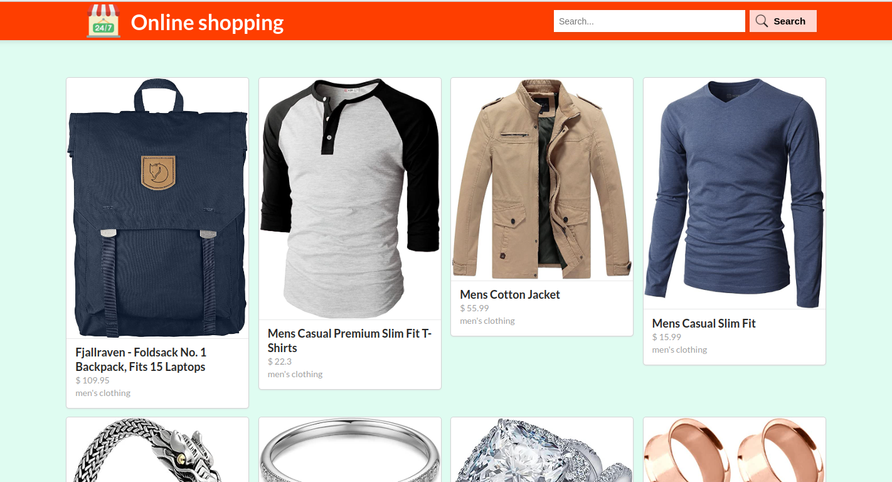

# Online Shopping
This project is based on an eCommerce website built with React and Redux. The user can check all the products in our and get more details on selected product. The user can also search for a product in our store.

## Milestones

- [x] Milestone 1: **React app setup with redux using the duck pattern**
- [x] Milestone 2: **Set up the app navigation using react-router**
- [x] Milestone 3: **Create an API layer using the fakeStore API**
- [x] Milestone 4: **Create the Redux store including the action creators and the reducers**
- [x] Milestone 5: **Integrate the redux store into the app and display the data**
- [x] Milestone 6: **Implement Product searching and get details functionalities**

## Project picture

## Live demo
[Project link](https://et-online-shopping.netlify.app/)

## Description video
[Loom Video Link](https://www.loom.com/share/c9e2e7d8cc8b4da29050e6c3e464a3ec)

## Built With 

- HTML
- CSS
- JavaScript ES6
- React
- Redux
- Jest

## Getting Started
To get a local copy of this exercise, Please follow these simple example steps.

1. Clone this repository or download the Zip folder:

**``git@github.com:29td/online-shopping.git``**

2. Navigate to the location of the folder in your machine:

**``you@your-Pc-name:~$ cd <folder>``**

3. Press Entqer to navigate to your local clone.
4. Open terminal and run this command npm install
5. after finishing step 5, run this command npm start to run the project
6. for testing components, you can run: npm run test.

Now you can go and play with it as you wish :smile:

## Authors

👤 **Eric TuyishimireEric**

- GitHub: [@TuyishimireEric](https://github.com/TuyishimireEric)
- LinkedIn: [@TuyishimireEric](https://www.linkedin.com/in/TuyishimireEric/)
- E-mail: <a href="mailto:tuyishimireericc@gmail.com">tuyishimireericc@gmail.com</a>

## Show your support
Give a ⭐️ if you like this project!

## 🤝 Contributing

Contributions, issues, and feature requests are welcome!

Feel free to check the [issues page](https://github.com/29td/online-shopping/issues).

## Acknowledgments

- Hat tip to anyone whose code was used
- Big thanks to the [Microverse](https://bit.ly/MicroverseTN) community with a special mention of my coding partners, morning session teams, standup teams and reviewers.

## 📝 License
This project is [MIT](./LICENSE.txt) licensed.
